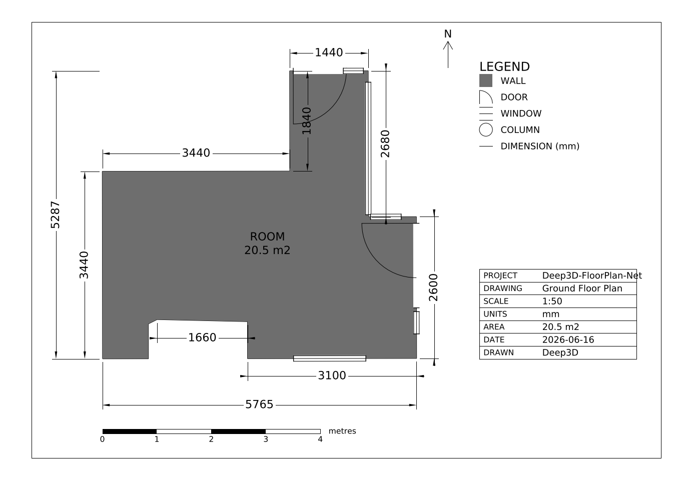

# Semantic Segmentation of 3D Point Clouds and Floor Plan Prediction

<div align="center">

| 3D Point Cloud Scan | | Engineering Floor Plan |
|:---:|:---:|:---:|
|  | **&#10132;** |  |

</div>

## Table of Contents

1.  [Overview](#1-overview)
2.  [The Pipeline](#2-the-pipeline)
    *   [Stage 1: 3D Semantic Segmentation](#21-stage-1-3d-semantic-segmentation)
    *   [Stage 2: Structural Extraction and Geometric Refinement](#22-stage-2-structural-extraction-and-geometric-refinement)
    *   [Stage 3: 2D Floor Plan Generation](#23-stage-3-2d-floor-plan-generation)
3.  [Usage Guide](#3-usage-guide)
    *   [Environment Setup](#31-environment-setup)
    *   [Script: Planar Cloud Extraction (Segmentation Only)](#32-script-planar-cloud-extraction-segmentation-only)
    *   [Script: Floor Plan Extraction (Full Pipeline)](#33-script-floor-plan-extraction-full-pipeline)
    *   [Script: Planar Mesh Reconstruction](#34-script-planar-mesh-reconstruction)
    *   [Configuration](#35-configuration)

---

## 1. Overview

This document details an automated pipeline designed to convert raw 3D point cloud data of indoor environments into structured, two-dimensional floor plans. The core challenge lies in translating an unstructured set of millions of points into a semantically meaningful and geometrically accurate architectural drawing.

Our approach leverages a multi-stage process that combines deep learning with classical geometric algorithms:

1.  **Semantic Understanding:** The pipeline first employs a powerful 3D semantic segmentation model (**RandLANet**) to assign a categorical label (e.g., `wall`, `floor`, `door`, `clutter`) to every point in the cloud.
2.  **Geometric Refinement:** Recognizing that deep learning models can produce noisy or incomplete segmentations, a crucial post-processing step uses **RANSAC** (RANdom SAmple Consensus) to fit geometric primitives (planes and cylinders) to the structural elements. This allows the system to correct misclassifications and intelligently reclaim points from the `clutter` category.
3.  **Engineering Floor Plan:** Finally, the refined 3D structural cloud is reduced to a metric, Manhattan-regularized room polygon and emitted as a dimensioned technical drawing (**DXF/PDF**) and a parametric **IFC/BIM** model — walls, openings, dimensions, and a legend, with no raster/Hough step.

This hybrid methodology ensures that the final output is not only semantically informed but also geometrically robust, resulting in high-quality architectural plans from raw scan data.


---

## 2. The Pipeline

The pipeline transforms a raw 3D point cloud into a 2D floor plan through three distinct stages: Semantic Segmentation, Geometric Refinement, and 2D Plan Generation. Each stage builds upon the output of the previous one to progressively add structure and accuracy.

### 2.1. Stage 1: 3D Semantic Segmentation

This initial stage is responsible for assigning a meaningful category to every point in the 3D space, forming the foundation for all subsequent processing.

#### 2.1.1. Model and Pipeline Preparation

The pipeline's core is powered by the **Open3D-ML** library, which provides a framework for 3D machine learning tasks.

*   **Model Selection:** We utilize the **RandLANet** model, pre-trained on the comprehensive **S3DIS (Stanford 3D Indoor Scene Dataset)**. This model is chosen for its state-of-the-art performance and high mean Intersection-over-Union (mIoU) score on indoor segmentation tasks.
*   **Configuration:** The pipeline is initialized by loading the `randlanet_s3dis.yml` configuration file, which contains all necessary parameters for the model's architecture, data handling, and training/testing procedures.
*   **Weight Loading:** The system is designed for ease of use. It first checks for a local copy of the pre-trained model weights (checkpoint file). If a checkpoint is not found, it automatically establishes an HTTP request to download the necessary files.

#### 2.1.2. Data Preparation

For the RandLANet model to process custom data correctly, the input point cloud must be structured in a specific dictionary format. An improperly formatted input will result in a runtime error.

The required dictionary must contain the following keys:
*   `point`: An array of shape `(N, 3)` containing the (X, Y, Z) coordinates for all *N* points in the cloud.
*   `feat`: An array of shape `(N, 3)` containing the (R, G, B) color values for each point. These values are typically normalized to the range [0, 1].
*   `label`: An array of shape `(N,)` used as a placeholder during inference. It is typically initialized with zeros.

#### 2.1.3. Inference 

With the pipeline and data prepared, the inference process can begin. The input data dictionary is fed into the pre-trained model, which classifies each point.

**Problem Statement Formulation**

Let the input point cloud be a set of $N$ points in 3D space:
```math
P = \{p_i \in \mathbb{R}^3 \mid i = 1, \dots, N\}
```

The model uses a set of predefined semantic labels $L$ from the S3DIS dataset:
```python
s3dis_labels = {
    0: 'unlabeled', 1: 'ceiling', 2: 'floor',  3: 'wall',    4: 'beam',
    5: 'column',    6: 'window',  7: 'door',    8: 'table',   9: 'chair',
    10: 'sofa',     11: 'bookcase',12: 'board',   13: 'clutter'
}
```
The segmentation model, represented as a function $f_{\text{model}}$, takes the point cloud $P$ as input and outputs a predicted label vector $\hat{Y}$, where each element $\hat{y}_i$ corresponds to a point $p_i$:

```math
\hat{Y} = f_{\text{model}}(P) = \{\hat{y}_1, \hat{y}_2, \dots, \hat{y}_N\}, \quad \text{where } \hat{y}_i \in L
```

The point cloud is then partitioned into distinct subsets $P_l$ based on these inferred labels, allowing us to isolate specific architectural elements:

```math
P_l = \{ p_i \in P \mid \hat{y}_i = l \}, \quad \text{where } l \in L
```
Sample Output:  
Input .Ply indoor scan file ([Download Here]( https://drive.google.com/file/d/12G2ybHiIUwcarr9TjmRYsoLz61BEN-Zn/view)):  
  
Inference from RandLANet:  
 

---
### 2.2. Stage 2: Structural Extraction and Geometric Refinement

The raw output from the semantic segmentation model, while powerful, is not perfect. Structural elements are often incomplete, with many of their points misclassified into the `clutter` category. This stage addresses this issue by using geometric priors—the assumption that elements like walls are planar and columns are cylindrical—to intelligently refine the initial segmentation.

#### 2.2.1. Initial Class Segregation

First, we partition the segmented point cloud $P$ into three distinct groups based on their labels.

Let the sets of labels for structural components, furniture, and other excluded classes be defined as:
*   **Structural Classes ($S_{\text{struct}}$):** Labels for components essential to the floor plan.
```math
S_{\text{struct}} = \{\text{floor, wall, beam, column, window, door}\} 
```
*   **Furniture Classes ($F_{\text{furn}}$):** Labels for furniture items, which are ignored.
```math 
F_{\text{furn}} = \{\text{table, chair, sofa, bookcase, board}\} 
```
*   **Excluded Classes ($E_{\text{exclude}}$):** All labels to be completely removed before refinement. This includes furniture, the ceiling, and any unlabeled points.
```math 
E_{\text{exclude}} = \{\text{unlabeled, ceiling}\} \cup F_{\text{furn}} 
```

Using these label sets, we define our initial point cloud groups:
1.  **Initial Structural Point Clouds ( $P_l$ for $l \in S_{\text{struct}}$ ):** The baseline sets of points for each structural class, taken directly from the segmentation output.
2.  **The Clutter Pool ($P_C$):** This is the set of points labeled as `clutter`. These points are candidates to be reassigned to a structural class.
```math 
P_C = \{ p_i \in P \mid \hat{y}_i = \text{clutter} \} 
```
3.  **Excluded Points:** All points belonging to classes in $E_{\text{exclude}}$ are discarded.

#### 2.2.2. Iterative RANSAC Refinement

The core of the refinement process is an iterative loop over each structural class. For each class, we identify its dominant geometric shape(s) using RANSAC (RANdom SAmple Consensus) and use these shapes to "claim" matching points from the clutter pool ($P_C$).

**A. Planar Class Refinement (`wall`, `floor`, `window`, `door`)**

For classes that are predominantly planar, the process is as follows:

1.  **Model Discovery (`discover_planes`):** For a given class (e.g., `wall`), we run RANSAC on its initial point cloud, $P_{\text{wall}}$, to find a set of plane models $\mathcal{M}_{\text{planes}}$. Each plane model $m \in \mathcal{M}_{\text{planes}}$ is defined by the Hessian normal form:
```math
m = (a, b, c, d) \quad \text{such that} \quad ax + by + cz + d = 0, \quad \text{with} \quad a^2+b^2+c^2=1 
```
2.  **Refinement (`refine_with_planes`):** We then test every point $p_c = (x_c, y_c, z_c)$ in the clutter pool $P_C$ against each discovered plane model $m$. A point $p_c$ is considered an **inlier** to model $m$ if its perpendicular distance to the plane is less than a threshold $\epsilon_{\text{plane}}$:
```math 
|ax_c + by_c + cz_c + d| < \epsilon_{\text{plane}} 
```
3.  **Update:** All inlier points found in $P_C$ are removed from the clutter pool and added to the corresponding structural point cloud. Let $I_l$ be the set of all inliers from $P_C$ for a class $l$. The sets are updated as:
```math 
    P'_l = P_l \cup I_l 
    P'_C = P_C \setminus I_l 
```

**B. Cylindrical Class Refinement (`column`, `beam`) (Optional)**

For classes expected to be cylindrical, a more specialized RANSAC is used:

1.  **Model Discovery:**
*   **Projection:** First, the 3D points of the class (e.g., $P_{\text{column}}$) are projected onto a 2D plane (the XZ-plane for vertical columns) by discarding the Y-coordinate:
```math
p=(x,y,z) \to p'=(x,z).
```
*   **2D RANSAC:** A manual RANSAC is performed on these 2D points to find circle models. A circle is defined by its center $c'=(c_x, c_z)$ and radius $r$. A point $p'$ is an inlier to a circle model if its distance from the perimeter is less than a threshold $\epsilon_{\text{circle}}$:
```math  
\left| \sqrt{(p'_x - c_x)^2 + (p'_z - c_z)^2} - r \right| < \epsilon_{\text{circle}} 
```
*   **Model Lifting:** The discovered 2D circle models are lifted into 3D vertical cylinder models, represented by a point on the axis, the axis direction vector, and the radius. Let this set be $\mathcal{M}_{\text{cylinders}}$.

2.  **Refinement:** Each point $p_c$ in the clutter pool $P_C$ is tested against each cylinder model. A point $p_c$ is an inlier to a cylinder model $(C_0, \vec{a}, r)$ (where $C_0$ is a point on the axis and $\vec{a}$ is the axis direction) if its distance to the cylinder's surface is less than a threshold $\epsilon_{\text{cylinder}}$. The distance of $p_c$ to the cylinder's axis is calculated first:
```math 
d(p_c, \text{axis}) = \frac{\| (p_c - C_0) \times \vec{a} \|}{\| \vec{a} \|} 
```
The point is an inlier if:
```math
| d(p_c, \text{axis}) - r | < \epsilon_{\text{cylinder}}
```
3.  **Update:** As with planar refinement, all cylindrical inliers are moved from the clutter pool $P_C$ to the appropriate structural class point cloud.

This iterative refinement process significantly improves the completeness of the structural elements, creating a much cleaner point cloud that is ready for the final floor plan generation stage.

Initial Result:
| <span style="color:red;">**Before (Raw 3D Segmentation Output)**</span> | <span style="color:blue;">**After (Iterative RANSAC Refinement)**</span> |
|:-------------------------------------------------------------------------:|:--------------------------------------------------------------------------:|
|               |                |
|               |                |
|               |                |
---
### 2.3. Stage 3: 2D Floor Plan Generation

With a clean, refined set of 3D structural points, the final stage reconstructs a metric room polygon and renders it as an **engineering technical drawing** (DXF/PDF) and a parametric **IFC/BIM** model. This is implemented in `floorplan_sota.py` (`generate`); unlike a raster Hough pipeline, every coordinate stays in metric units, so the output is measurable and CAD-ready. All tunable parameters live in [`configs/floorplan.yml`](configs/floorplan.yml) — there are no hardcoded numbers in the code.

#### 2.3.1. Manhattan Frame and Room Polygon

1.  **Dominant Orientation (`vertical_wall_lines`, `dominant_angle`):** Iterative RANSAC on the wall/window/door points recovers the vertical planes; each contributes a 2D line with unit normal $\mathbf{n}=(n_x,n_y)$. The dominant wall normal defines the room's Manhattan frame:
```math
\theta_0 = \operatorname{atan2}(n_y, n_x) \bmod \tfrac{\pi}{2}
```
All geometry is computed in this frame via the rotation $R(-\theta_0)$ and mapped back with $R(\theta_0)$.

2.  **Floor Footprint Rasterization (`room_from_floor_mask`):** The floor points are rotated into the Manhattan frame and rasterized into a binary mask at resolution $r$ (`room.mask_res`). Each point maps to a pixel:
```math
u_i = \left\lfloor \frac{x_i - x_{\min}}{r} \right\rfloor, \quad v_i = \left\lfloor \frac{y_i - y_{\min}}{r} \right\rfloor
```
A **morphological closing** fills furniture gaps, and the largest external contour is taken as the raw room boundary.

3.  **Rectilinear Regularization (`rectilinearize`):** The contour is simplified (`cv2.approxPolyDP`) and each edge is locked to the nearest axis; a vertex is replaced by the intersection of its two adjacent axis-locked edges, producing clean right angles. An edge $(\mathbf{a},\mathbf{b})$ is treated as horizontal when:
```math
|b_x - a_x| \ge |b_y - a_y|
```
The result is a watertight, metric room polygon $P_{\text{room}}$ that handles rectangular and L/T-shaped rooms. If it degenerates (area outside `room.area_lo`–`room.area_hi` of the floor bounding box), the pipeline falls back to the Manhattan-oriented bounding box (`room_from_floor_obb`). The method is selectable via `method: auto | floor_mask | obb`.

#### 2.3.2. Architectural Elements

1.  **Openings (`detect_openings`):** For each edge with direction $\hat{\mathbf{u}}$, door/window points within `openings.band` of the edge are projected onto it via $t=(\mathbf{p}-\mathbf{a})\cdot\hat{\mathbf{u}}$. The opening span is the robust $[\text{pct\_lo}, \text{pct\_hi}]$ percentile range of $t$, and its sill/head come from the $z$-range of those points.

2.  **Columns (`detect_columns`):** Column points are clustered with DBSCAN; compact clusters lying strictly inside $P_{\text{room}}$ are kept as circular columns, discarding wall fragments.

#### 2.3.3. Engineering Technical Drawing

The polygon and elements are emitted by `export_drawing` (sheet) and `export_ifc` (BIM). Coordinates are scaled from metres to millimetres, $c_{\text{mm}} = 1000\,c_{\text{m}}$, and drawn on standard CAD layers with wall poché (hatch), door swings, and window symbols.

*   **Dimensions:** every wall run and the overall extents are auto-dimensioned. For an edge the annotated length is $L=\lVert \mathbf{b}-\mathbf{a} \rVert$, and the overall sizes are $W=x_{\max}-x_{\min}$ and $H=y_{\max}-y_{\min}$ (in mm).
*   **Sheet:** a legend, title block (scale `drawing.scale`, units mm), scale bar, and north arrow are added. Outputs are **DXF** (editable CAD), **PDF/PNG** (rendered sheet), and **IFC** (parametric walls, slabs, openings, doors, windows, and columns).

Final Result:


---
## 3. Usage Guide

This section provides all the necessary steps to set up the environment and run the various scripts included in the project.

### 3.1. Environment Setup

It is highly recommended to use a dedicated Conda environment to manage the project's dependencies. This ensures that the correct package versions are used and avoids conflicts with other projects.

1.  **Create and Activate the Conda Environment:**
    Open your terminal and run the following commands to create a new environment named `floorplan` with Python 3.8.18 and activate it.

    ```bash
    conda create -n floorplan python=3.8.18 -y
    conda activate floorplan
    ```

2.  **Install Required Packages:**
    Navigate to the `scripts` directory within the project folder. All required packages are listed in the `requirements.txt` file. Install them using pip.

    ```bash
    cd path/to/your/project/scripts
    pip install -r requirements.txt
    ```

With the environment set up, you can now run the processing scripts.

### 3.2. Script: Planar Cloud Extraction (Segmentation Only)

This script runs only the initial semantic segmentation stage. It processes an input point cloud and saves the raw point clouds for major structural categories (floor, walls, etc.) and all other categories into separate files. No RANSAC refinement is performed.

*   **Script:** `segmentation_pcd_extract.py`
*   **Arguments:**
    *   `--data_path`: **(Required)** Path to the input point cloud file (`.ply`).
    *   `--output_dir`: **(Required)** Directory where the output `.ply` files (e.g., `walls.ply`, `floor.ply`, `others.ply`) will be stored.
*   **Example:**
    ```bash
    python segmentation_pcd_extract.py --data_path ../data/conferenceRoom_1.ply --output_dir ../output/segmented_parts/
    ```

### 3.3. Script: Floor Plan Extraction (Full Pipeline)

This is the main script that executes the entire pipeline: from semantic segmentation and RANSAC refinement to the final 2D floor plan generation.

*   **Script:** `pcd_to_floorplan.py`
*   **Arguments:**
    *   `--data_path`: **(Required)** Path to the input point cloud file (`.ply`).
    *   `--output_dir`: **(Required)** Directory for the floor-plan outputs — `floor_plan.dxf` (CAD), `floor_plan.pdf`/`.png` (rendered sheet), and `model.ifc` (BIM). See [Configuration](#35-configuration) for the standalone run and config.
    *   `--refine_cylinders`: **(Optional Flag)** Enables the RANSAC cylinder fitting routine for columns and beams. This can improve results in rooms with columns but will increase processing time.
    *   `--vis_prediction`: **(Optional Flag)** Opens the Open3D-ML visualizer to show the raw semantic segmentation results on the point cloud.
    *   `--vis_open3d`: **(Optional Flag)** Opens a visualizer to compare the structural point cloud before and after RANSAC refinement.
*   **Example:**
    ```bash
    python pcd_to_floorplan.py \
      --data_path ../data/conferenceRoom_1.ply \
      --output_dir ../output/ \
      --refine_cylinders \
      --vis_open3d
    ```

### 3.4. Script: Planar Mesh Reconstruction

This utility script takes individual point clouds of structural elements (like those generated by `segmentation_pcd_extract.py`) and attempts to reconstruct a 3D mesh from them.

*   **Script:** `reconstruct.py`
*   **Arguments:**
    *   `-iw, --walls_file`: Input point cloud of just the walls.
    *   `-if, --floor_file`: Input point cloud of the floor.
    *   `-ic, --ceiling_file`: Input point cloud of the ceiling.
    *   `-io, --others_file`: Input point cloud of all other points.
    *   `-o, --output`: Path for the output mesh file (e.g., `out.ply`).
    *   `-m, --meshing_algorithm`: Algorithm to use. Options are `poisson` (default), `ball_pivot`, or `alpha_shapes`.
    *   `--no_projection`: **(Optional Flag)** Do not project all points to a plane.
    *   `--no_segmentation`: **(Optional Flag)** Do not process wall segments individually.
*   **Example:**
    ```bash
    python reconstruct.py \
      -iw ../output/segmented_parts/walls.ply \
      -if ../output/segmented_parts/floor.ply \
      -ic ../output/segmented_parts/ceiling.ply \
      -io ../output/segmented_parts/others.ply \
      -o ../output/reconstructed_mesh.ply \
      -m poisson
    ```


---

### 3.5. Configuration

Two YAML files drive the pipeline.

**`configs/randlanet_s3dis.yml`** (Stage 1 — semantic segmentation), loaded by `load_assets.get_pipeline` to build the Open3D-ML RandLA-Net model:
*   `dataset`: S3DIS settings — `num_points` (points sampled per inference window), `class_weights`, `test_area_idx`, `cache_dir`.
*   `model`: RandLA-Net architecture — `num_neighbors`, `num_layers`, `num_classes` (13 S3DIS classes), `sub_sampling_ratio`, `in_channels`, `dim_features`, `grid_size`; `ckpt_path` is set automatically.
*   `pipeline`: `SemanticSegmentation` runtime — `batch_size`, `val_batch_size`, optimizer `lr`, `scheduler_gamma`, `main_log_dir`.

**`configs/floorplan.yml`** (Stage 3 — floor plan), loaded by `floorplan_sota.generate`. Every result-affecting number lives here, nothing is hardcoded:
*   `method`: `auto | floor_mask | obb` — room reconstruction method (`auto` = `floor_mask` with `obb` fallback).
*   `wall_thickness`: drawn / IFC wall thickness (m).
*   `walls`: vertical-plane RANSAC (`voxel`, `ransac_dist`, `vertical_tol`, `max_planes`, `min_inliers`).
*   `room`: floor-mask reconstruction (`mask_res`, `morph_kernel`, `morph_iters`, `approx_tol`, `simplify`, `area_lo`, `area_hi`).
*   `openings`: door/window detection (`band`, `min_points`, `pct_lo`, `pct_hi`, `min_width`).
*   `columns`: DBSCAN column detection (`eps`, `min_points`, `r_min`, `r_max`, `interior_margin`).
*   `ceiling_fallback_height`: storey height used when no ceiling points (m).
*   `drawing`: `scale` (sheet 1:N) and `door_swing_max` (door arc cap, m).

Generate the floor plan from the segmented point clouds (run from `scripts/`):
```bash
python floorplan_sota.py --config ../configs/floorplan.yml \
  --seg_dir output/segmented_parts --out_dir output/sota
# switch reconstruction method without touching code:
python floorplan_sota.py --method obb
```
Outputs: `floor_plan.dxf` (editable CAD), `floor_plan.pdf`/`.png` (rendered sheet), `model.ifc` (BIM), `floorplan.json` (metrics). A self-contained smoke test verifies the full path on a synthetic room:
```bash
python test_floorplan.py
```
